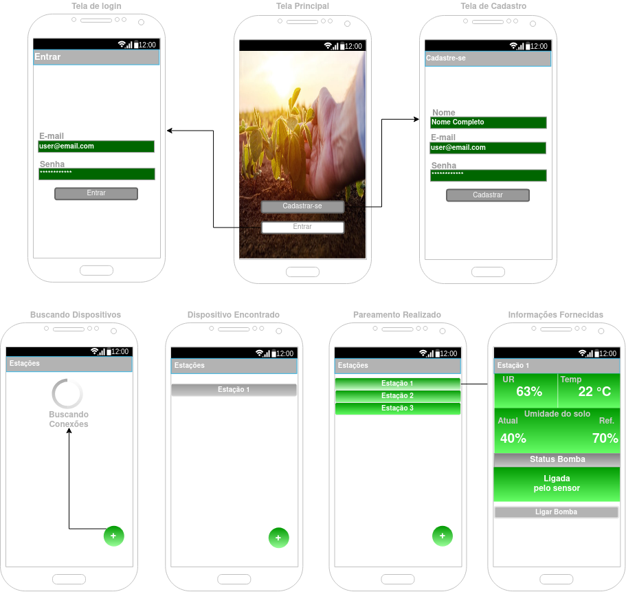
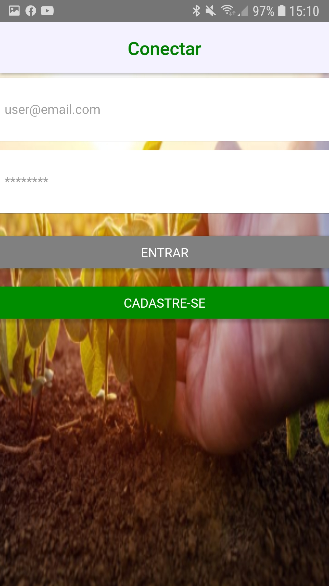
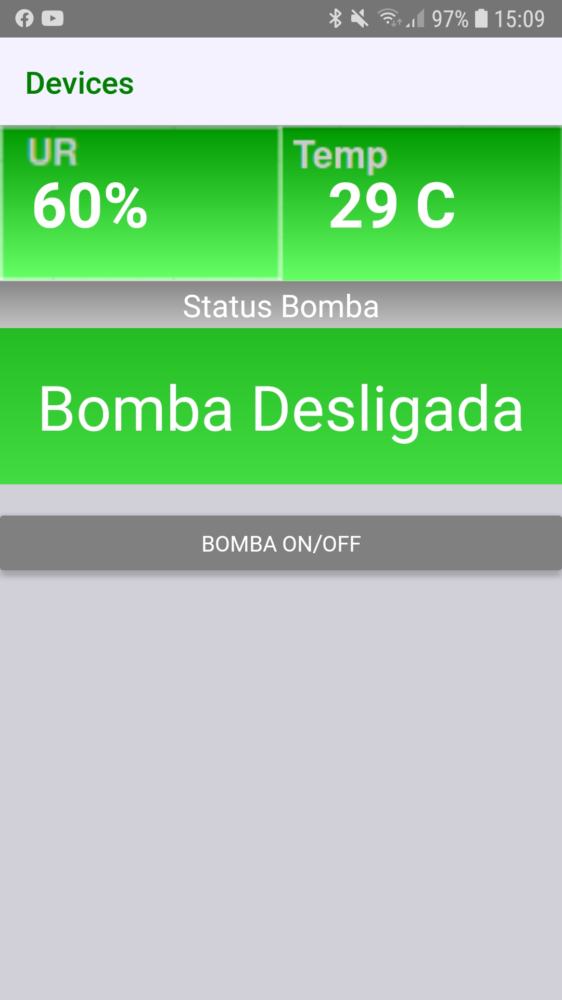

# PlantControl

This application connects to an embedded system through BLE communication. The device has the function of collecting data of relative humidity,
ambient temperature and soil moisture of a plant or a vegetable garden. In addition to collecting this information, it will have the function 
of turning on a water pump to increase soil moisture.
The pump will be started automatically based on the value read from the soil moisture sensor in relation to the pre-defined reference value. 
The pump can also be activated manually.

**Content:**

- [Screens React Native](#screns-react-native)
- [Circuit with ESP32](#circuit-with-ESP32)

<!-- /TOC -->
<!-- markdownlint-restore -->
<!-- Due to a bug in Markdown TOC, the table is formatted incorrectly if tab indentation is set other than 4. Due to another bug, this comment must be *after* the TOC entry. -->

## Screens React Native

The illustration of the initial screens initially thought are: the registration and login screens, the search screens for a new device and the information screen for the selected device.

 

Connect Screen            |  Data Screen
:-------------------------:|:-------------------------:
   |  

## Circuit with ESP32

Circuit that collects temperature and relative humidity data, using DHT11 and a led to simulate a water pump.

 
